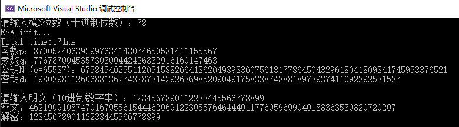
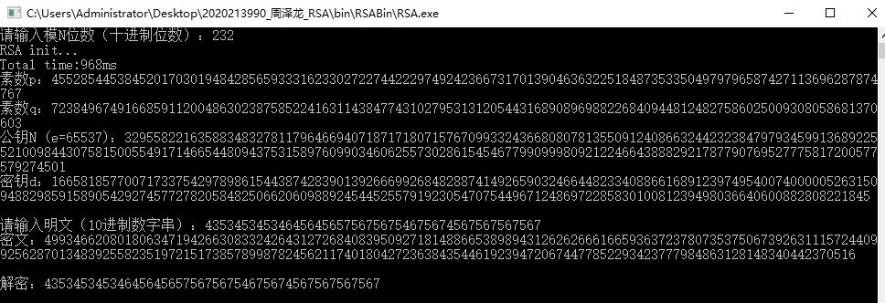
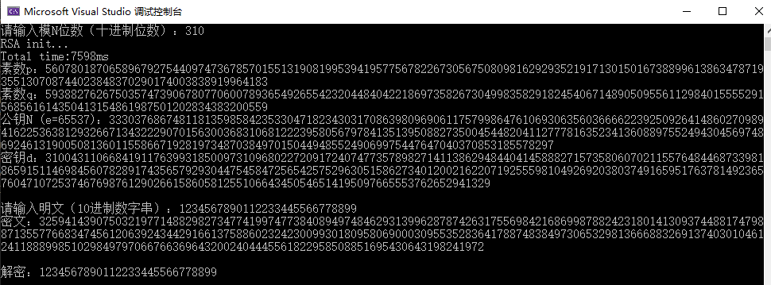
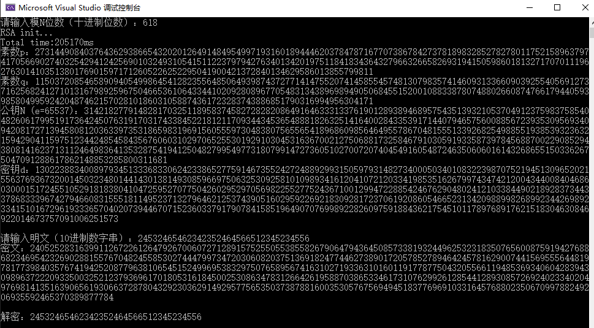
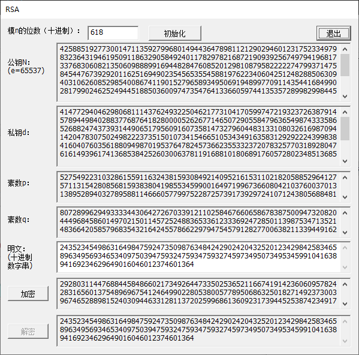

# RSA实验报告

**姓名：周泽龙**
**学号：2020213990**
**课程：应用密码学**
**日期：2020年11月15日**

------

## 1 完成内容

软件实现RSA：

* 1024位以上公私钥的生成
* 768位以下公私钥在 1s内生成 
* 明文加密、密文解密
* 图形界面GUI
* 语言：C++
* IDE：Visual Studio 2019

## 2 程序使用说明

### 2.1 非图形界面

* 首先输入想要的模N的位数

  * **10进制**表示

* 程序自动生成公私钥

* 其次输入想要加密的明文

  * **10进制数字串**

* 程序自动生成密文，并自动对密文解密

* 2进制，10进制位数对照与公私钥生成时间表如下：

  * | 2进制位 | 10进制位 |          时间（ms）           |
    | :-----: | :------: | :---------------------------: |
    |   256   |    78    |              171              |
    |   768   |   232    |  968 |
    |  1024   |   309    |             7598              |
    |  2048   |   617    |            205170             |

### 2.2 图形界面

* 首先输入模n的位数，然后点击“初始化”按钮
  * 初始化过程中，按钮“加密”、“解密”和“初始化”为灰色状态，不可按
  * 初始化结束，即生成公私钥结束后，按钮“加密”变为黑色状态，可按
  * “初始化”按钮可重复点击，**重新初始化**
* 输入明文数字串
* 点击“加密”按钮
  * 按钮“解密”变为黑色状态，可按
* 点击“解密”按钮
  * 输出解密后的信息
  * 按钮“解密”变为灰色状态，不可按
* 可**重复加解密**信息

## 3 总结

### 3.1 实验感想与收获

* 太久没写C++，重新拾起后，不是在写C++，而是在写BUG
* 实现自己的高精度类，有点困难，但收获颇丰，想到了很多优化方法，如多线程、移位操作等，但没有实现，有以下两点原因：
  * 时间不足
  * 一开始的架构设计不佳，导致后期不好进行改动和优化

### 3.2 课程建议

* 期末大作业早点公布（＞人＜；），不想再经历期中这种大作业堆积的困境了。